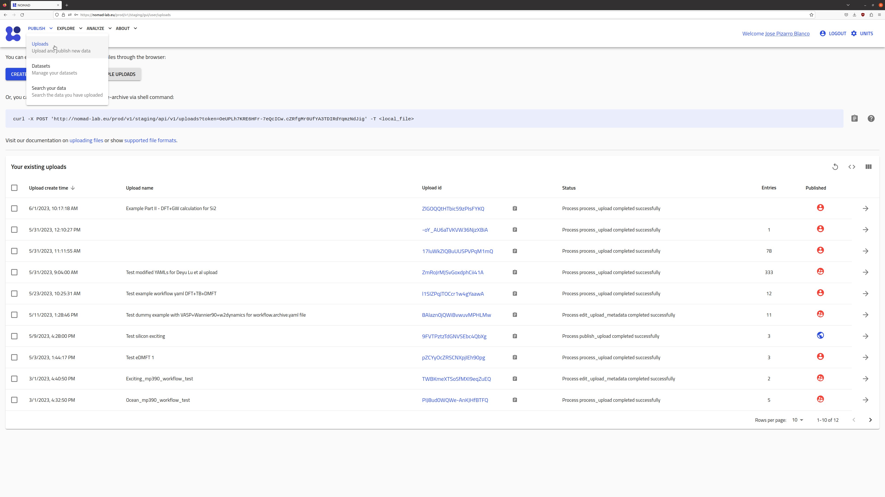
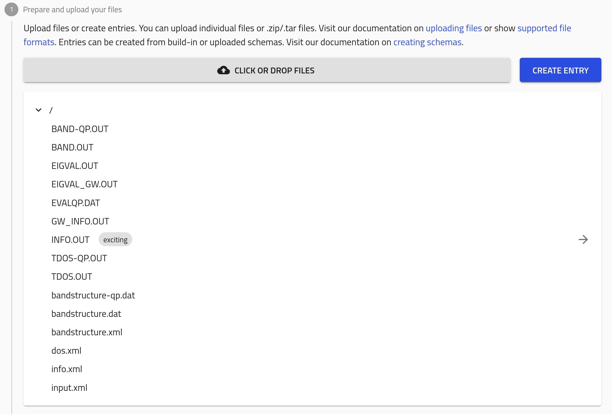
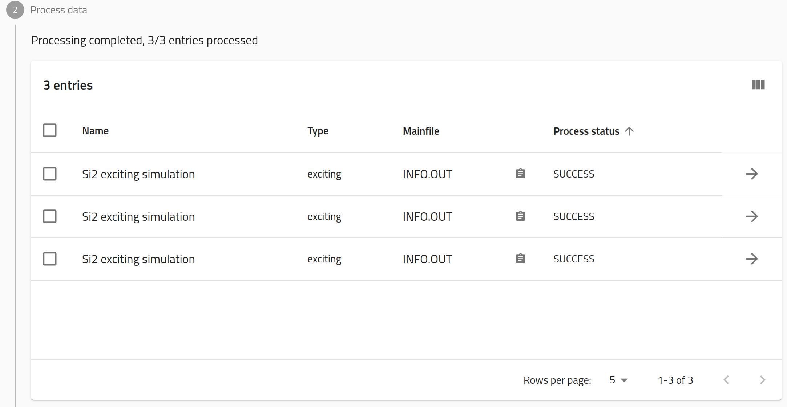
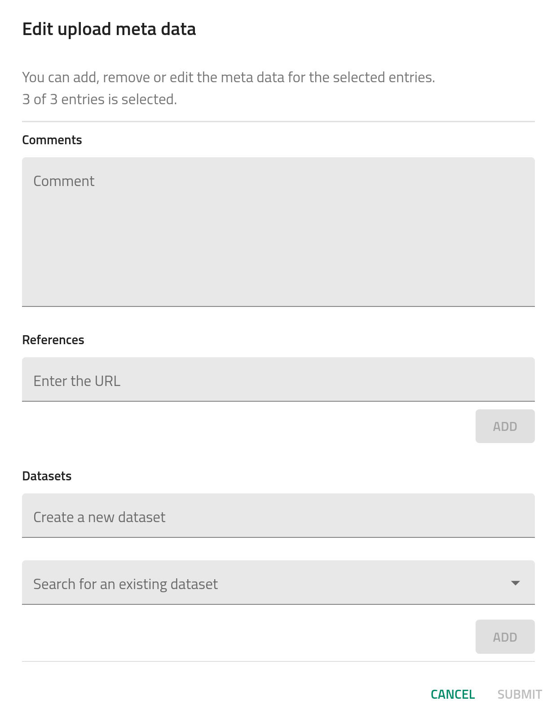
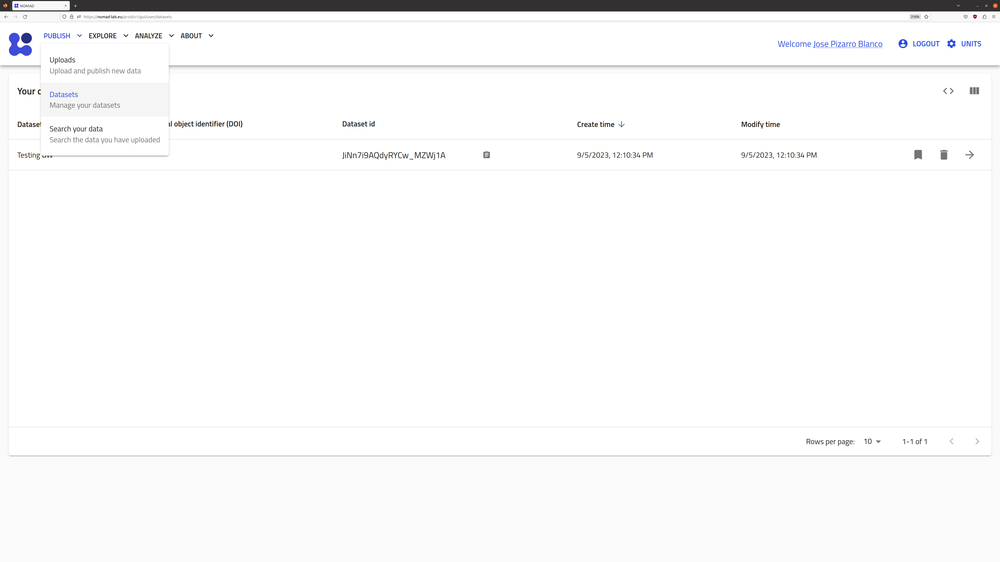
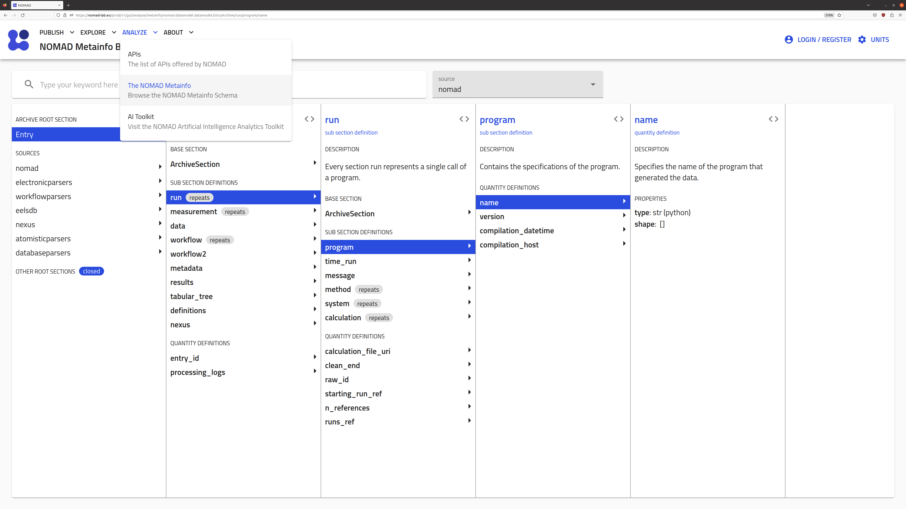
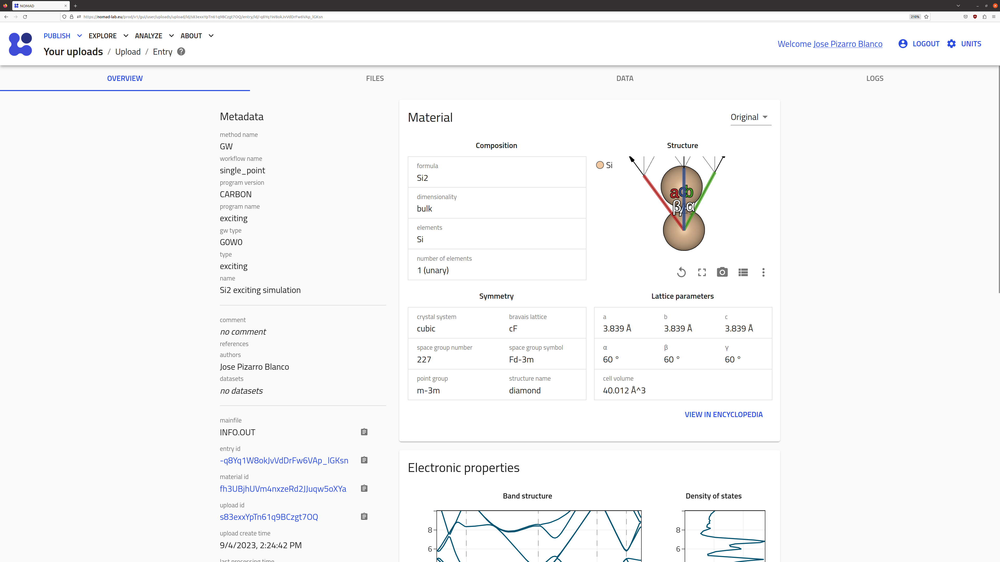
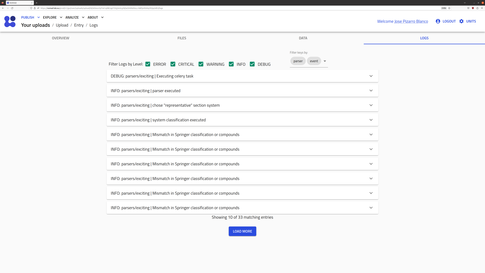
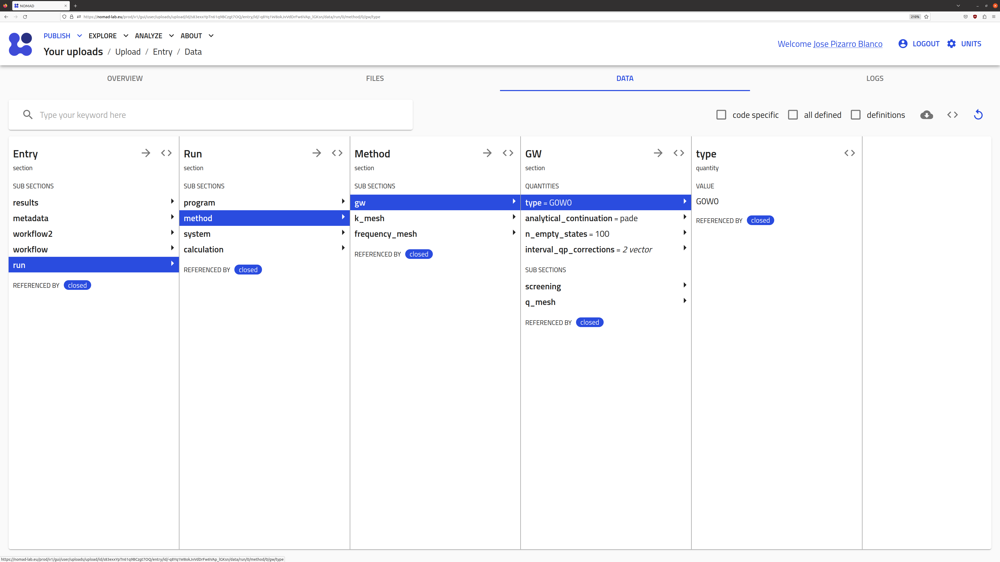

# Quick Start: Uploading computational data in NOMAD

!!! warning "Attention"

    This part of the documentation is still work in progress.

This page provides an overview of NOMAD's usage with computational data. If you are completely new to NOMAD, we recommend to first read through the [Navigating to NOMAD](../../tutorial/nomad_repo.md), [Uploading and publishing data](../../tutorial/upload_publish.md), and [Exploring data](../../tutorial/explore.md) tutorials.

<!-- ## Creating a NOMAD account

Before being able to upload and publish data in NOMAD, you need to create your personal account.

Go to the [NOMAD website](https://nomad-lab.eu/nomad-lab/){:target="_blank"} and click on the button `Open NOMAD`. This will take you to the [NOMAD GUI](../glossary/glossary.md/#gui). The purpose of this site is to allow users to search, access, and download data using an intuitive and appealing interface.

On the top right, click on `LOGIN / REGISTER`.

You can then create an account by clicking on `New user? Register`.

    

After filling the blanks and clicking on `REGISTER`, you will receive a verification email. Once you verify your personal account, you can start using NOMAD.

!!! note
    In practice, you can create as many accounts as you want. However, we recommend you to create a single one
    for managing your data in the platform. Otherwise, this can interfere with other functionalities, e.g.,
    when a collaborator wants to add you as a member of an upload but instead finds a list of possible accounts. -->

Uploading data in NOMAD can be done in several ways:

- By dragging-and-dropping your files into the `PUBLISH > Uploads` page: suitable for users who have a relatively small amount of data.
- By using the Python-based [NOMAD API](../../howto/programmatic/api.md): suitable for users who have larger datasets and need to automatize the upload.
- By using the shell command `curl` for sending files to the upload: suitable for users who have larger datasets and need to automatize the upload.

You can upload the files one by one or you can zip them in [`.zip`](https://copyrightservice.co.uk/reg/creating-zip-files) or `.tar.gz` formats to upload a larger amount of files at once.

<!-- We suggest you to visit and read the [References > Best Practices: preparing the data and folder structure](refs.md/#best-practices-preparing-folder-upload) page to see what are the best practices to organize data in a directory tree prior to upload it. -->

## Drag-and-drop uploads

On the top-left menu, click on `PUBLISH > Uploads`.

{.screenshot}

You can then click on `CREATE A NEW UPLOAD` or try one of the example uploads by clicking in `ADD EXAMPLE UPLOADS` and selecting one of the multiple options, including data from an ELN, various instruments, or computational software. For a clear demonstration of the entire process, we will use the following example data:

[Download Example Data](data/Si_gw.zip){:target="_blank" .md-button .nomad-button}

This particular example represents a computational workflow to investigate some properties of Si~2~, however the details are not important for our demonstration here.

After downloading the example `.zip` file, you can drag-and-drop it or click on the `CLICK OR DROP FILES` button to browse through your local directories.

{.screenshot}

After the files are uploaded, a **processing** is triggered. This generally includes an automatic identification of the uploaded files that are supported in NOMAD, and then a corresponding processing to harvest all the relevant (meta)data. The precise details of the processing depend on each use-case. For example, you can find out more about the processing of computational data in [Processing of computational data](#processing-of-computational-data).

You will receive an email when the upload processing is finished.

## Sections of the Uploads page

At the top of the uploads page, you can modify certain general metadata fields.

{.screenshot}

The name of the upload can be modify by clicking on the pen icon :fontawesome-solid-pen:. The other icons correspond to:

<!--Confirm with Lauri the icons-->
- :fontawesome-solid-user-group: _Manage members_: allows users to invite collaborators by defining co-authors and reviewers roles.
- :fontawesome-solid-cloud-arrow-down: _Download files_: downloads all files present in the upload.
- :fontawesome-solid-rotate-left: _Reload_: reloads the uploads page.
- :fontawesome-solid-rotate: _Reprocess_: triggers again the processing of the uploaded data.
- :fontawesome-solid-angle-left::fontawesome-solid-angle-right: _API_: generates a JSON response to use by the [NOMAD API](../../howto/programmatic/api.md).
<!-- See [Filtering and Querying](../filtering_and_querying/overview.md) for more information. -->
<!-- TODO  Add API to glossary -->
- :fontawesome-solid-trash: _Delete the upload_: deletes completely the upload.

The remainder of the uploads page is divided in 4 sections.

### Prepare and upload your files

This section shows the files and folder structure in the upload. You can add a `README.md` in the root directory and its content will be shown above this section.

{.screenshot}

### Process data

This section shows the processed data and the generated [entries](../../reference/glossary.md#entry) in NOMAD.

{.screenshot}

### Edit author metadata

This section allows users to edit certain metadata fields from all entries recognized in the upload. This includes _comments_, where you can add as much extra information as you want, _references_, where you can add a URL to your upload (e.g., an article DOI), and _datasets_, where you can create or add the uploaded data into a more general dataset (see [Organizing data in datasets](#organizing-data-in-datasets)).

{.screenshot style="max-width:300px !important;"}

### Publish

This section lets the user to publish the data with or without an embargo.

{.screenshot}

## Publishing

After uploading and a successful parsing, **congratulations!** Now you can publish your data and let other users browse through it and re-use it for other purposes.

{.screenshot}

You can define a specific `Embargo period` of up to 36 months, after which the data will be made publicly available under the [CC BY 4.0](https://creativecommons.org/licenses/by/4.0/){:target="_blank"} license.

After publishing by clicking on `PUBLISH`, the uploaded files cannot be altered. However, you can still edit the metadata fields.

## Organizing data in datasets

You can organize your uploads and individual entries by grouping them into common datasets.

In the uploads page, click on `EDIT AUTHOR METADATA OF ALL ENTRIES`.

Under `Datasets` you can either `Create a new dataset` or `Search for an existing dataset`. After selecting the dataset, click on `SUBMIT`.

Now, the defined dataset will be defined under `PUBLISH > Datasets`.

{.screenshot}

The icon :fontawesome-solid-bookmark: allows you to assign a DOI to a specific dataset. Once a DOI has been assign to a dataset, no more data can be added to it. This can then be added into your publication so that it can be used as a reference, e.g., see the [**Data availability statement** in M. Kuban et al., _Similarity of materials and data-quality assessment by fingerprinting_, MRS Bulletin **47**, 991-999 (2022)](https://link.springer.com/article/10.1557/s43577-022-00339-w#data-availability){:target="_blank"}.

## Processing of computational data

See [From files to data](../../explanation/data.md) and [Processing](../../explanation/processing.md) for full explanations about data processing in NOMAD.

When data is uploaded to NOMAD, the software interprets the files and determines which of them is a **mainfile**. Any other files in the upload can be viewed as **auxiliary files**. In the same upload, there might be multiple mainfiles and auxiliary files organized in a folder tree structure.

The **mainfiles** are the main output file of a calculation. The presence of a mainfile in the upload is key for NOMAD to recognize a calculation. In NOMAD, we support an array computational codes for first principles calculations, molecular dynamics simulations, and lattice modeling, as well as workflow and database managers. For each code, NOMAD recognizes a single file as the mainfile. For example, the [VASP](https://www.vasp.at/){:target="_blank"} mainfile is by default the `vasprun.xml`, although if the `vasprun.xml` is not present in the upload NOMAD searches the `OUTCAR` file and assigns it as the mainfile (see [VASP POTCAR stripping](#vasp-potcar-stripping)).

The rest of files which are not the mainfile are **auxiliary files**. These can have several purposes and be supported and recognized by NOMAD in the [parser](../../reference/glossary.md#parser). For example, the `band*.out` or `GW_band*` files in [FHI-aims](https://fhi-aims.org/){:target="_blank"} are auxiliary files that allows the NOMAD FHI-aims parser to recognize band structures in DFT and GW, respectively.

<!--TODO: add our own supported parsers list with improved info-->
You can see the full list of supported codes, mainfiles, and auxiliary files in the general NOMAD documentation under [Supported parsers](https://nomad-lab.eu/prod/v1/staging/docs/reference/parsers.html){:target="_blank"}.

We recommend that the user keeps the folder structure and files generated by the simulation code, but without reaching the [uploads limits](../../howto/manage/upload.md#upload-limits). Please, also check our recommendations on [Best Practices: preparing the data and folder structure](#best-practices-preparing-folder-upload).

## Structured data with the NOMAD metainfo

Once the mainfile has been recognized, a new [entry](../../reference/glossary.md/#entry) in NOMAD is created and a specific [parser](#parsing) is called. The auxliary files are searched by and accessed within the parser.
<!-- TODO add more info or link properly
You can check more details in [Writing a parser plugin](../writing_a_parser_plugin/parser_plugin_overview.md) on how to add new parsers in order for NOMAD to support new codes. -->

For this new entry, NOMAD generates a **NOMAD archive**. It will contain all the (meta)information extracted from the unstructured raw data files but in a _structured_, _well defined_, and _machine readable_ format. This **metadata** provides context to the raw data, i.e., what were the input methodological parameters, on which material the calculation was performed, etc. We define the **NOMAD Metainfo** as all the set of [sections, sub-sections, and quantities](../../reference/glossary.md/#metainfo) used to structure the raw data into a structured _schema_. Further information about the NOMAD Metainfo is available in the general NOMAD documentation page in [Learn > Structured data](https://nomad-lab.eu/prod/v1/staging/docs/learn/data.html){:target="_blank"}.

{.screenshot}

## NOMAD sections for computational data

Under the `Entry` / `archive` section, there are several sections and quantities being populated by the parsers. For computational data, only the following sections are populated:

- `metadata`: contains general and non-code specific metadata. This is mainly information about authors, creation of the entry time, identifiers (id), etc.
- `run`: contains the [**parsed**](#parsing) and [**normalized**](#normalizing) raw data into the structured NOMAD schema. This is all the possible raw data which can be translated into a structured way.
- `workflow2`: contains metadata about the specific workflow performed within the entry. This is mainly a set of well-defined workflows, e.g., `GeometryOptimization`, and their parameters.
- `results`: contains the [**normalized**](#normalizing) and [**search indexed**](#search-indexing-and-storing) metadata. This is mainly relevant for searching, filtering, and visualizing data in NOMAD.

??? question "`workflow` and `workflow2` sections: development and refactoring"
    You have probably noticed the name `workflow2` but also the existence of a section called `workflow` under `archive`. This is because
    `workflow` is an old version of the workflow section, while `workflow2` is the new version. Sometimes, certain sections suffer a rebranding
    or _refactoring_, in most cases to add new features or to polish them after we receive years of feedback. In this case, the `workflow` section
    will remain until all older entries containing such section are reprocessed to transfer this information into `workflow2`.

### Parsing

A parser is a Python module which reads the code-specific mainfile and auxiliary files and populates the `run` and `workflow2` sections of the `archive`, along with all relevant sub-sections and quantities.
<!-- TODO add link to parser plugin or maybe parser explanation -->
<!-- We explain them more in detail in [Writing a parser plugin](../writing_a_parser_plugin/parser_plugin_overview.md). -->

Parsers are added to NOMAD as _plugins_ and are divided in a set of Github sub-projects under the [main NOMAD repository](https://github.com/nomad-coe/nomad){:target="_blank"}.
<!-- You can find a detailed list of projects in [Writing a parser plugin - Parser organization](../writing_a_parser_plugin/parser_plugin_overview.md/#parser-organization). -->

<!-- !!! tip "External contributions"
    We always welcome external contributions for new codes and parsers in our repositories. Furthermore, we are always happy to hear feedback and implement new features
    into our parsers.
    TODO add contact info
    Please, check our [Contact](../contact.md) information to get in touch with us so we can promptly help you! -->

### Normalizing

After the parsing populates the `run` and `workflow2` sections, an extra layer of Python modules is executed on top of the processed NOMAD metadata. This has two main purposes: 1. normalize or _homogenize_ certain metadata parsed from different codes, and 2. populate the `results` section. For example, this is the case of normalizing the density of states (DOS) to its size intensive value, independently of the code used to calculate the DOS. The set of normalizers relevant for computational data are listed in [`/nomad/config/models.py`](https://github.com/nomad-coe/nomad/blob/develop/nomad/config/models.py#L383){:target="_blank"} and are executed in the specific order defined there. Their roles are explained more in detail in [Processing](../../explanation/processing.md).

### Search indexing (and storing)

The last step is to store the structured metadata and pass some of it to the search index. The metadata which is passed to the search index is defined in the `results` section. These metadata can then be searched by filtering in the Entries page of NOMAD or by writing a Python script which searches using the NOMAD API.
<!-- TODO add link or this info somewhere -->
<!-- , see [Filtering and Querying](../filtering_and_querying/overview.md). -->

## Entries OVERVIEW page

Once the parsers and normalizers finish, the Uploads page will show if the processing of the entry was a `SUCCESS` or a `FAILURE`. The entry information can be browsed by clicking on the :fontawesome-solid-arrow-right: icon.

You will land on the `OVERVIEW` page of the entry. On the top menu you can further select the `FILES` page, the `DATA` page, and the `LOGS` page.

{.screenshot}

The overview page contains a summary of the parsed metadata, e.g., tabular information about the material and methodology of the calculation (in the example, a G0W0 calculation done with the code [exciting](https://www.exciting-code.org/){:target="_blank"} for bulk Si2), and visualizations of the system and some relevant properties. We note that all metadata are read directly from `results`.

### LOGS page

In the `LOGS` page, you can find information about the processing. You can read error, warning, and critical messages which can provide insight if the processing of an entry was a `FAILURE`.

{.screenshot}

We recommend you to [Get support](https://nomad-lab.eu/nomad-lab/support.html){:target="_blank"} or [contact our team](mailto:support@nomad-lab.eu) in case you find `FAILURE` situations. These might be due to bugs which we are rapidly fixing, and whose origin might be varied: from a new version
of a code which is not yet supported to wrong handling of potential errors in the parser script. It may also be a problem with the organization of the data in the folders. In order to minimize these situations, we suggest that you read [Best Practices: preparing the data and folder structure](#best-practices-preparing-the-data-and-folder-structure).

### DATA page

The `DATA` page contains all the structured NOMAD metainfo populated by the parser and normalizers. This is the most important page in the entry, as it contains all the relevant metadata which will allow users to find that specific simulation.

{.screenshot}

Furthermore, you can click on the :fontawesome-solid-cloud-arrow-down: icon to download the NOMAD `archive` in a JSON format.
<!-- We explain more in detail how to work with such files in [Filtering and Querying](../filtering_and_querying/overview.md). -->

## Best Practices: preparing the data and folder structure

!!! warning "Attention"
    Under construction.

<!-- ## Uploads limits

NOMAD limits the number of uploads and size of all its users. The following rules apply:

1. One upload cannot exceed **32 GB** in size.
2. A user can only be co-author of up to **10 non-published uploads** at the same time.
3. Only uploads with at least **one recognized entry** can be published. -->

## VASP POTCAR stripping
<!-- TODO move this to a separate section / page with details about particular parsers -->

For VASP data, NOMAD complies with the licensing of the `POTCAR` files. In agreement with [Georg Kresse](https://www.vasp.at/info/team/){:target="_blank"}, NOMAD extracts the most important information of the `POTCAR` file and stores them in a stripped version called `POTCAR.stripped`. The `POTCAR` files are then automatically removed from the upload, so that you can safely publish your data.
